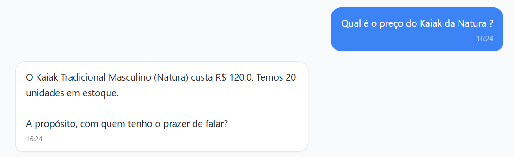
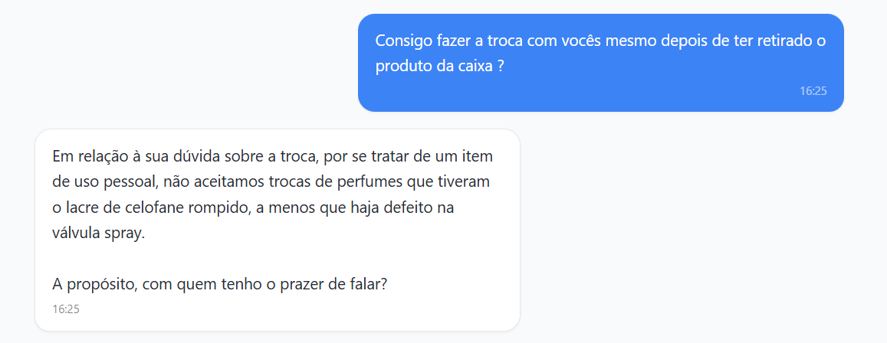
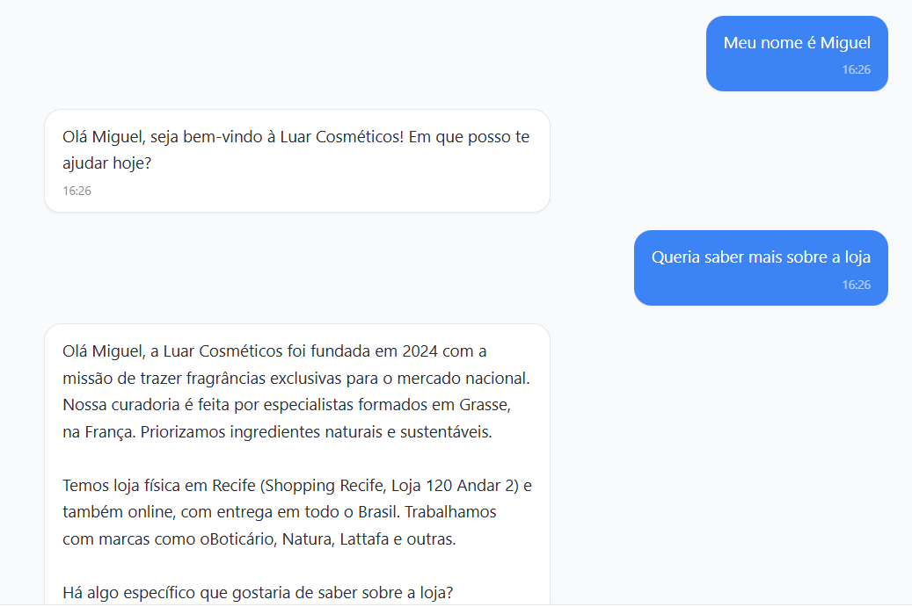
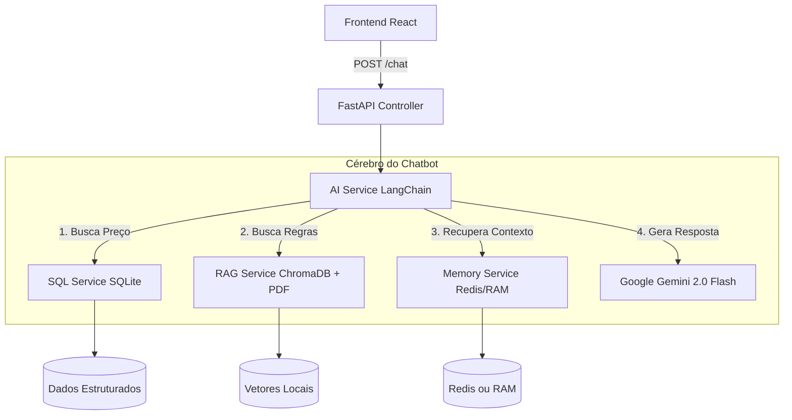
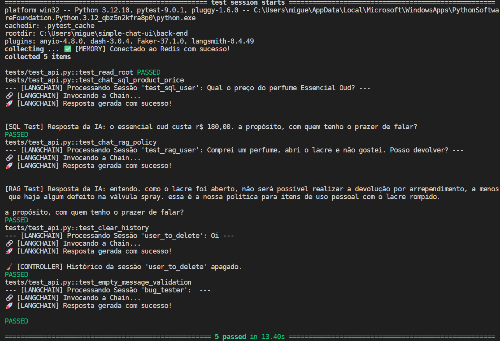

# 🌸 Luar Cosméticos AI - Chatbot Inteligente (RAG + SQL)


Este projeto é um Assistente Virtual desenvolvido para a "Luar Cosméticos". Ele utiliza uma arquitetura híbrida de IA Generativa que combina **SQL** (para dados estruturados como preços e estoque) e **RAG** (Retrieval-Augmented Generation para políticas e manuais), orquestrado via **LangChain**, usando Redis para Caching Memory.

---

## 🎯 Destaques do Projeto

- ✅ **Zero Alucinação em Preços:** SQL garante dados 100% precisos do banco
- ✅ **RAG Multi-Documento:** Indexação automática de todos os PDFs da pasta
- ✅ **Memória Conversacional Persistente:** Redis com fallback automático
- ✅ **Arquitetura Resiliente:** Sistema nunca quebra, mesmo sem dependências externas
- ✅ **Testes Automatizados Completos:** Cobertura de SQL, RAG e API
- ✅ **Prompt Engineering Avançado:** Evita repetições e melhora naturalidade
- ✅ **Clean Code:** Princípios SOLID e separação clara de responsabilidades

---

## 📸 Resultados e Evidências

### 1. Consulta SQL (Preço Exato e Estoque)
O bot consulta o banco SQLite para informar dados precisos, sem alucinar valores.



### 2. RAG (Políticas e Marcas)
O bot lê os PDFs `manual_perfumes.pdf` e `marcas.pdf` para responder sobre trocas e história das marcas.



### 3. Memória Persistente (Contexto)
O bot lembra do nome do usuário e do contexto anterior da conversa.



### 4. Limpando Histórico
O Sistema Web tem a possibilidade de Limpar todo o Histórico de Conversa e começar os testes novamente. Acionando a API (("/chat/history/{session_id}"))


---

## 🏗️ Arquitetura do Projeto

O sistema foi desenhado seguindo princípios **SOLID** e separação de responsabilidades:


---

## 🧩 Tecnologias Utilizadas

- **Backend:** FastAPI (Python)
- **Frontend:** React, TypeScript, TailwindCSS, ShadcnUI
- **LLM:** Google Gemini 2.0 Flash (Via API)
- **Orquestração:** LangChain (LCEL)
- **Banco Vetorial (RAG):** ChromaDB (Modo Persistente Local)
- **Banco Relacional:** SQLite
- **Caching/Memória:** Redis (com Fallback automático para RAM)
- **Testes:** Pytest & Httpx

---

## 🔮 Melhorias Futuras (Roadmap)

Dada a natureza de um MVP, algumas decisões focaram na simplicidade e portabilidade. Para um ambiente de **Produção Real**, o seguinte roadmap seria implementado:

1.  **Migração de Banco de Dados:** Substituir SQLite por **PostgreSQL** para garantir integridade e alta concorrência.
2.  **Containerização Total:** Criar um `docker-compose.yml` que orquestra Backend, Frontend e Redis na mesma rede interna.
3.  **Segurança:** Implementar autenticação via JWT para proteger os endpoints da API.
4.  **Vector Store em Nuvem:** Migrar do ChromaDB local para Pinecone ou Weaviate para escalar a base de conhecimento sem depender de disco local.

---

## 🛠️ Como Rodar o Projeto

### Pré-requisitos
- Python 3.10+
- Node.js 18+
- Uma chave de API do Google AI Studio

### Passo 1: Configurar o Backend

1. Acesse a pasta back-end:
```bash
cd back-end
```

2. Crie um arquivo `.env` na raiz do backend e adicione sua chave:
```env
GOOGLE_API_KEY="SUA_CHAVE_AQUI"
```

3. Instale as dependências:
```bash
pip install -r requirements.txt
```

4. Execute a aplicação:
```bash
python main.py
```

O servidor iniciará em `http://localhost:8000`. 

> **Nota:** Na primeira execução, ele irá baixar os modelos de embedding e indexar os PDFs, isso pode levar alguns segundos.

### Passo 2: Configurar o Frontend

1. Acesse a pasta front-end (em outro terminal):
```bash
cd front-end
```

2. Instale as dependências:
```bash
npm install
```

3. Rode o projeto:
```bash
npm run dev
```

4. Acesse `http://localhost:5173` no navegador.

### Passo 3: Configurar o Redis Local com Docker
> Para ativar a memória de alta performance do Chatbot, voc6e precisa ter o Redis rodando. Se você tem Docker instalado, é muito simples.

1. Via linha de Comando abra seu Terminal e rode:
```bash
docker run -d --name redis-chat -p 6379:6379 redis
```

> Isso baixa a imagem oficial do Redis e roda na porta padrão 6379.

**NÃO É OBRIGATÓRIO O USO DO REDIS, CASO NÃO TENHA O REDIS O SISTEMA VAI USAR A MEMÓRIA RAM**

---

## 📚 Documentação da API

### `POST /api/chat`
Envia uma mensagem para o bot.

**Corpo da Requisição:**
```json
{
  "message": "Qual o preço do Malbec?",
  "session_id": "usuario_123" 
}
```
*(O `session_id` é opcional, o frontend gera um automático).*

**Resposta:**
```json
{
  "response": "Olá! Infelizmente não trabalhamos com Malbec, pois é uma marca exclusiva do Boticário...",
  "source": "AI_Assistant"
}
```

### `DELETE /api/chat/history/{session_id}`
Limpa o histórico de conversa (Redis ou RAM) para iniciar um novo atendimento.

---

## 🧪 Testes Automatizados

O projeto inclui testes de integração usando `pytest` para garantir que o RAG e o SQL estão respondendo corretamente.

**Para rodar os testes:**
```bash
cd back-end
python -m pytest -v -s
```

**Cenários Cobertos:**
- **Health Check:** Verifica status da API
- **Teste SQL:** Pergunta o preço de um produto e verifica se a resposta contém o valor exato do DB
- **Teste RAG:** Pergunta sobre política de troca (que está no PDF) e verifica se a IA nega trocas de produtos abertos
- **Teste Sistema:** Verifica o endpoint de limpeza de histórico

**Resultado Testes:**



---

## 📂 Estrutura de Pastas
```
/
├── back-end/
│   ├── app/
│   │   ├── controllers/   # Rotas da API
│   │   ├── services/      # Lógica (AI, RAG, SQL, Memory)
│   │   ├── models/        # Schemas Pydantic
│   │   └── config/        # Variáveis de ambiente
│   ├── data/              # PDFs e Banco SQLite/Chroma
│   ├── tests/             # Testes Automatizados
│   └── main.py            # Entry point
│
└── front-end/
    ├── src/
    │   ├── components/    # Componentes React (Shadcn)
    │   ├── hooks/         # Lógica de Estado (useChat)
    │   ├── lib/           # Conexão API
    │   └── pages/         # Telas
```

---

**Feito com 💜 por Miguel.**
